# FlowDesk Admin Backend — 아키텍처 문서

## 목차

1. [시스템 개요](#1-시스템-개요)
2. [기술 스택](#2-기술-스택)
3. [프로젝트 디렉터리 구조](#3-프로젝트-디렉터리-구조)
4. [계층 아키텍처](#4-계층-아키텍처)
5. [요청 생명 주기 (Request Lifecycle)](#5-요청-생명-주기-request-lifecycle)
6. [모듈 의존성 맵](#6-모듈-의존성-맵)
7. [인증 아키텍처 (Authentication)](#7-인증-아키텍처-authentication)
8. [인가 아키텍처 — RBAC (Authorization)](#8-인가-아키텍처--rbac-authorization)
9. [멀티테넌시 데이터 격리](#9-멀티테넌시-데이터-격리)
10. [데이터베이스 설계](#10-데이터베이스-설계)
11. [도메인 모듈 상세](#11-도메인-모듈-상세)
12. [예외 처리 아키텍처](#12-예외-처리-아키텍처)
13. [보안 아키텍처](#13-보안-아키텍처)
14. [API 엔드포인트 맵](#14-api-엔드포인트-맵)

---

## 1. 시스템 개요

FlowDesk Admin은 **멀티테넌트 B2B SaaS 어드민 시스템**의 백엔드 API 서버입니다.

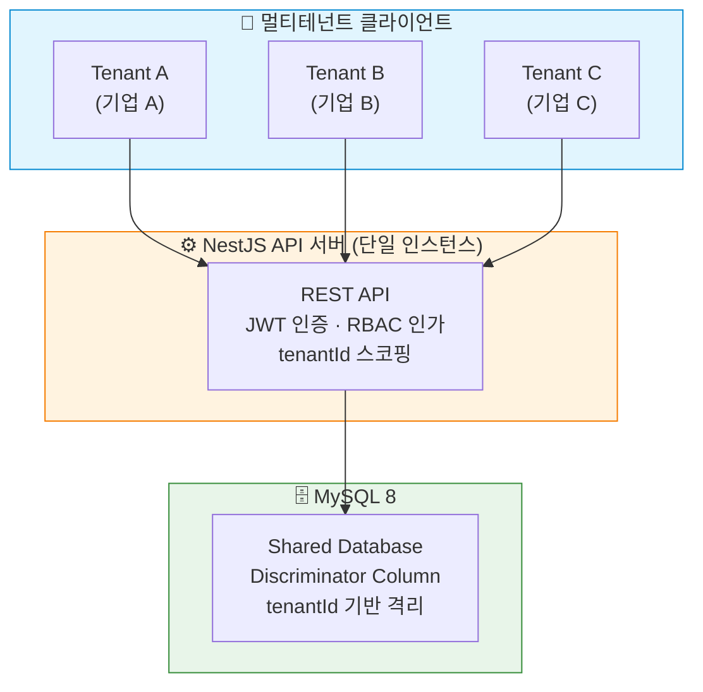

**핵심 설계 원칙:**
- 모든 쿼리에 `tenantId` 강제 적용 — 교차 테넌트 접근 구조적 차단
- `page.action` 기반 세분화된 RBAC 권한 모델
- JWT + tokenVersion 기반 즉시 토큰 무효화 메커니즘
- 계층형 커스텀 예외 체계로 내부 로그와 외부 응답 분리

---

## 2. 기술 스택

| 구분 | 기술 | 버전 |
|------|------|------|
| **Runtime** | Node.js | - |
| **Framework** | NestJS | 11.x |
| **Language** | TypeScript | 5.x |
| **ORM** | TypeORM | 0.3.x |
| **Database** | MySQL | 8.x |
| **인증** | Passport.js + JWT | passport 0.7, passport-jwt 4.x |
| **비밀번호 해싱** | bcrypt | 6.x |
| **입력 검증** | class-validator + class-transformer | 0.14.x / 0.5.x |
| **API 문서** | Swagger (OpenAPI) | nestjs/swagger 11.x |
| **보안 헤더** | Helmet | 8.x |
| **Rate Limiting** | @nestjs/throttler | 6.x |
| **DB 드라이버** | mysql2 | 3.x |
| **테스트** | Jest + Supertest | 30.x / 7.x |

---

## 3. 프로젝트 디렉터리 구조

```
backend/
├── src/
│   ├── main.ts                          # 앱 부트스트랩 (Helmet, ValidationPipe, Swagger, ExceptionFilter)
│   ├── app.module.ts                    # 루트 모듈 (모든 Feature Module 임포트)
│   ├── app.controller.ts               # 루트 헬스체크 엔드포인트
│   ├── app.service.ts
│   │
│   ├── common/                          # ▌횡단 관심사 (Cross-cutting Concerns)
│   │   ├── decorators/
│   │   │   ├── require-auth.decorator.ts      # @RequireAuth() 컴포지트 데코레이터
│   │   │   ├── require-permission.decorator.ts # @RequirePermission() 권한 메타데이터
│   │   │   └── transactional.decorator.ts
│   │   ├── dto/
│   │   │   └── error-response.dto.ts          # 표준 에러 응답 DTO (Swagger용)
│   │   ├── exceptions/
│   │   │   └── base.exception.ts              # 계층형 커스텀 예외 클래스
│   │   ├── filters/
│   │   │   └── global-exception.filter.ts     # 전역 예외 필터
│   │   ├── guards/
│   │   │   └── permission.guard.ts            # RBAC 권한 검증 Guard
│   │   ├── middleware/
│   │   │   └── request-id.middleware.ts       # 요청별 고유 ID (분산 추적)
│   │   └── utils/
│   │       ├── permission.util.ts             # 권한 키 생성/파싱 유틸
│   │       └── transaction.util.ts            # 트랜잭션 헬퍼 (QueryRunner)
│   │
│   ├── config/                          # ▌설정 레이어
│   │   ├── configuration.ts                   # DB 설정 registerAs
│   │   ├── database.config.ts                 # DB 설정 인터페이스
│   │   └── validation.ts                      # 환경변수 스키마 검증
│   │
│   ├── database/                        # ▌데이터베이스 인프라
│   │   ├── database.module.ts                 # TypeORM 비동기 설정 모듈
│   │   ├── typeorm.module-options.ts          # TypeORM 옵션 팩토리
│   │   ├── datasource.ts                     # CLI용 DataSource
│   │   └── migrations/                        # SQL 마이그레이션 파일
│   │
│   └── modules/                         # ▌도메인 모듈
│       ├── auth/                              # 인증 (JWT, 로그인, 회원가입, 토큰)
│       ├── rbac/                              # 권한 카탈로그 (Page, Action, Permission)
│       ├── roles/                             # 역할 관리 (Role, UserRole, RolePermission)
│       ├── users/                             # 사용자 관리
│       ├── tenants/                           # 테넌트 관리 + 커스텀 상태
│       ├── counsel/                           # 상담 관리 (동적 필드, 로그, 메모)
│       ├── websites/                          # 웹사이트/도메인 관리
│       ├── boards/                            # 게시판/게시글
│       ├── security/                          # IP·전화번호·금칙어 블랙리스트
│       ├── super/                             # 슈퍼 관리자 대시보드
│       ├── health/                            # 시스템 진단 (DB 연결 상태)
│       └── codes/                             # 공통 코드 엔티티
│
├── database/seeds/                      # SQL 시드 데이터
├── test/                                # E2E 테스트
├── tsconfig.json
├── nest-cli.json
└── package.json
```

---

## 4. 계층 아키텍처

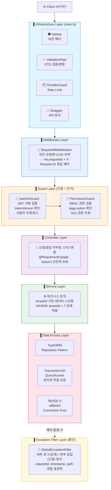

---

## 5. 요청 생명 주기 (Request Lifecycle)

인증+권한이 필요한 엔드포인트(`@RequireAuth`)의 전체 요청 흐름:

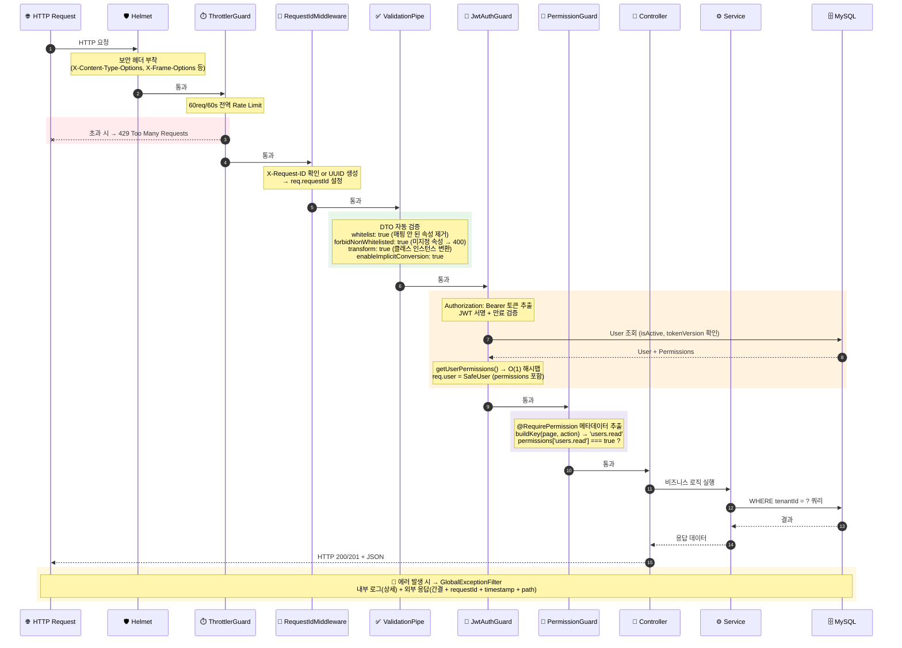

---

## 6. 모듈 의존성 맵

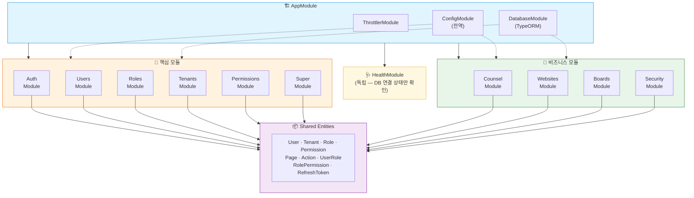

---

## 7. 인증 아키텍처 (Authentication)

### 7.1 토큰 전략

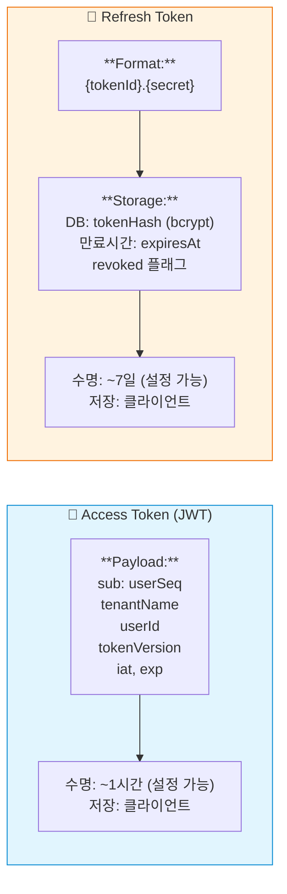

### 7.2 로그인 플로우

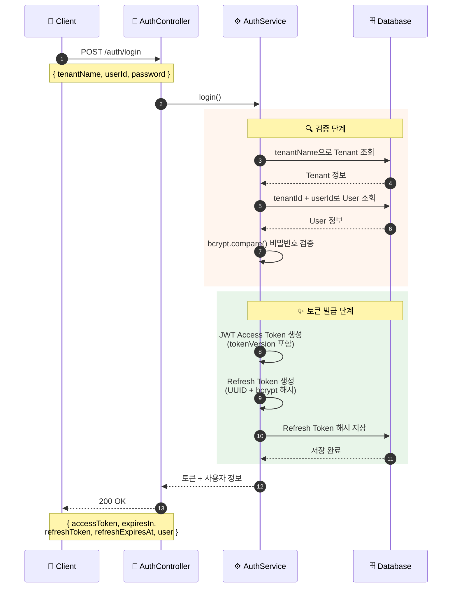

### 7.3 tokenVersion 기반 즉시 무효화

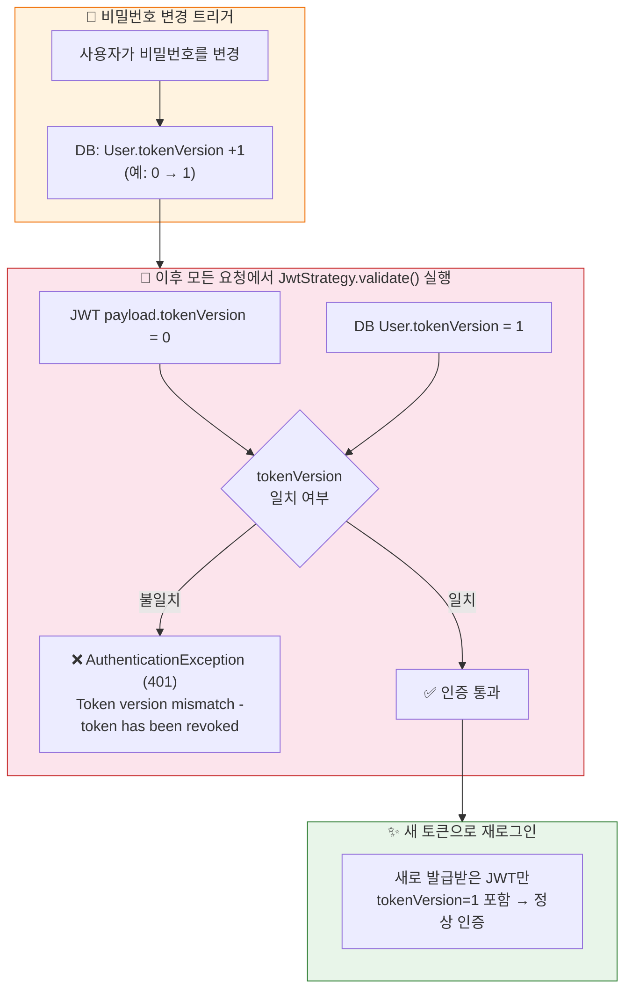

### 7.4 Refresh Token 로테이션

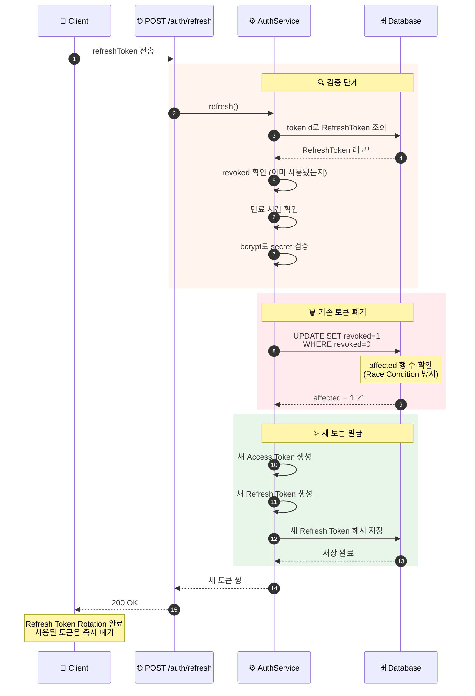

---

## 8. 인가 아키텍처 — RBAC (Authorization)

### 8.1 권한 모델 구조

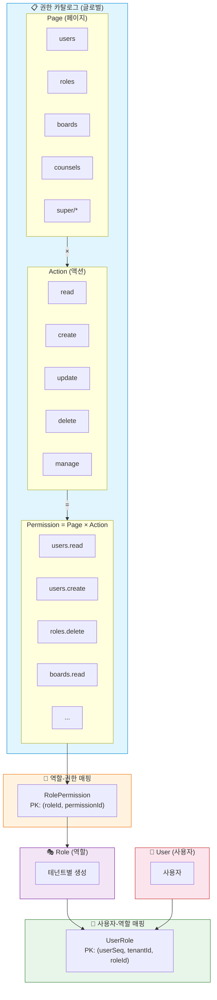

### 8.2 권한 검증 플로우 (런타임)

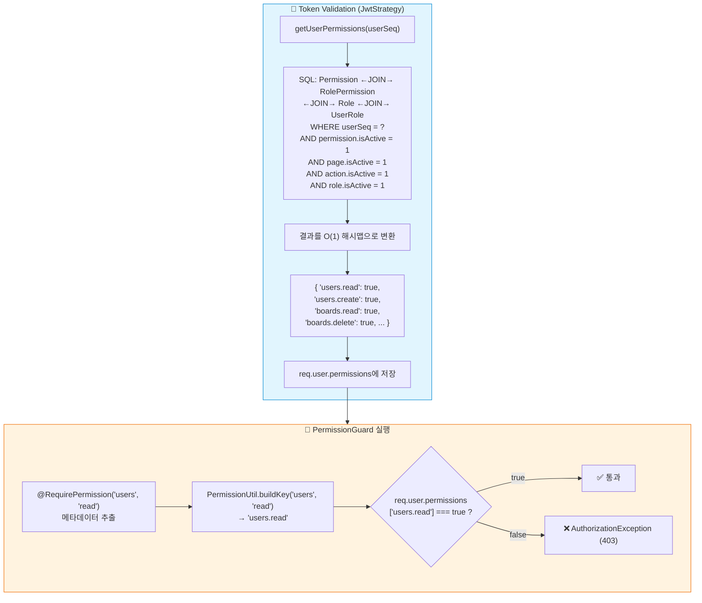

### 8.3 @RequireAuth 컴포지트 데코레이터

```typescript
@RequireAuth('users', 'read')
// 아래를 한번에 적용:
// ├─ @UseGuards(JwtAuthGuard, PermissionGuard)  — 인증 + 인가
// ├─ @RequirePermission('users', 'read')         — 권한 메타데이터
// ├─ @ApiBearerAuth('JWT')                       — Swagger 인증 마크
// ├─ @ApiUnauthorizedResponse(...)               — Swagger 401 문서
// └─ @ApiForbiddenResponse(...)                  — Swagger 403 문서
```

### 8.4 슈퍼 관리자 권한 필터링

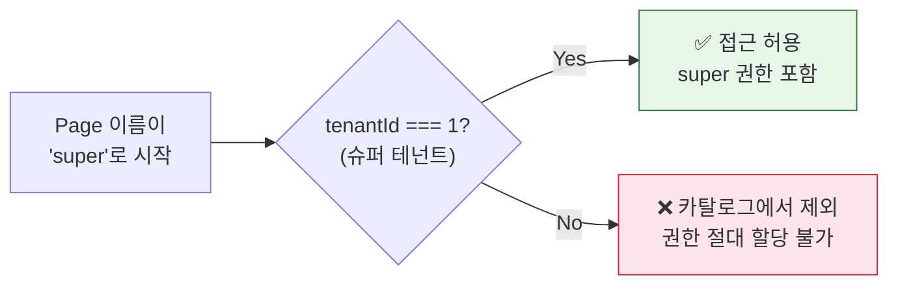

---

## 9. 멀티테넌시 데이터 격리

### 9.1 격리 전략: Shared Database, Discriminator Column

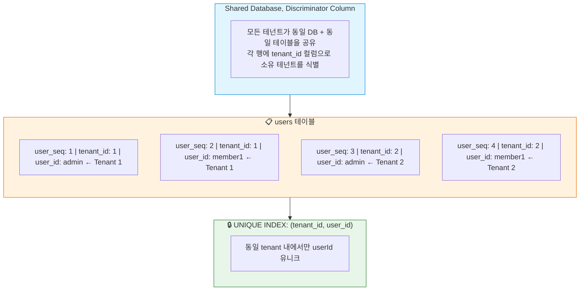

### 9.2 격리 적용 지점

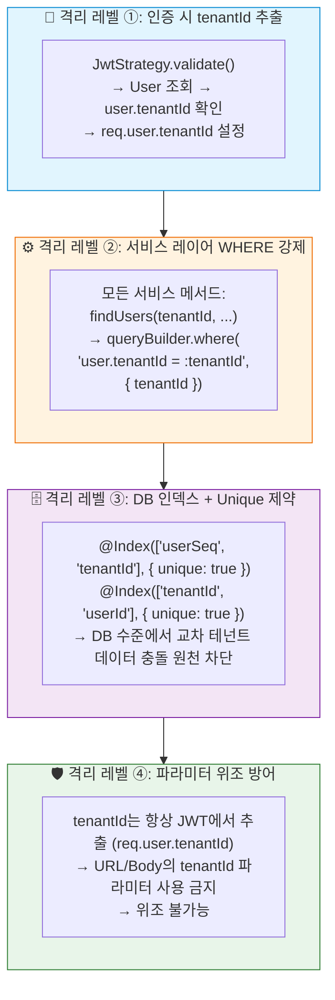

### 9.3 테넌트 스코핑 적용 엔티티

| 엔티티 | tenantId FK | 격리 수준 |
|--------|-------------|-----------|
| User | ✅ | 테넌트 스코핑 |
| Role | ✅ | 테넌트 스코핑 |
| UserRole | ✅ (복합 PK) | 테넌트 스코핑 |
| Counsel | ✅ | 테넌트 스코핑 |
| CounselFieldDef | ✅ | 테넌트 스코핑 |
| CounselFieldValue | ✅ (복합 PK) | 테넌트 스코핑 |
| CounselLog | ✅ (복합 PK) | 테넌트 스코핑 |
| CounselMemoLog | ✅ | 테넌트 스코핑 |
| Website | ✅ | 테넌트 스코핑 |
| Board | ✅ | 테넌트 스코핑 |
| Post | ✅ | 테넌트 스코핑 |
| BlockIp | ✅ | 테넌트 스코핑 |
| BlockHp | ✅ | 테넌트 스코핑 |
| BlockWord | ✅ | 테넌트 스코핑 |
| TenantStatus | ✅ | 테넌트 스코핑 |
| Tenant | - | 글로벌 카탈로그 |
| Page | - | 글로벌 카탈로그 |
| Action | - | 글로벌 카탈로그 |
| Permission | - | 글로벌 카탈로그 |
| RolePermission | - | 글로벌 (Role이 테넌트 스코핑) |
| RefreshToken | - | 사용자(userSeq) 스코핑 |

---

## 10. 데이터베이스 설계

### 10.1 ER 다이어그램

```mermaid
erDiagram
    tenants {
        int tenant_id PK
        string tenant_name
        string display_name
        bool is_active
        string domain
    }
    
    users {
        int user_seq PK
        int tenant_id FK
        string user_id
        string user_pwd
        string corp_name
        string user_name
        int token_version
        bool is_active
    }
    
    roles {
        int role_id PK
        int tenant_id FK
        string role_name
        string display_name
        string description
        bool is_active
    }

    tenant_status {
        int tenant_status_id PK
        int tenant_id FK
        string status_group
        string status_key
        string status_name
        string color
        int sort_order
    }

    user_roles {
        int user_seq PK "FK"
        int tenant_id PK "FK"
        int role_id PK "FK"
    }

    role_permissions {
        int role_id PK "FK"
        int permission_id PK "FK"
    }

    permissions {
        int permission_id PK
        int page_id FK
        int action_id FK
        string display_name
        bool is_active
    }

    pages {
        int page_id PK
        int parent_id FK
        string page_name
        string path
        string display_name
    }

    actions {
        int action_id PK
        string action_name
        string display_name
    }

    websites {
        string web_code PK
        int tenant_id FK
        int user_seq FK
        string web_url
        int duplicate_allow_after_days
    }

    counsel {
        int counsel_seq PK
        int tenant_id FK
        string web_code FK
        int counsel_stat FK
        int emp_seq FK
        string name
        string counsel_hp
        string counsel_ip
        string duplicate_state
    }

    counsel_log {
        int counsel_seq PK "FK"
        int tenant_id PK "FK"
        int log_no PK
        int counsel_stat FK
        datetime reg_dtm
    }

    counsel_field_value {
        int counsel_seq PK "FK"
        int tenant_id PK "FK"
        int field_id PK "FK"
        string value_text
        number value_number
        date value_date
        datetime value_datetime
    }

    counsel_memo_log {
        int memo_log_id PK
        int counsel_seq FK
        int tenant_id FK
        int status_id FK
        int created_by FK
        string memo_text
        bool is_deleted
    }

    counsel_field_def {
        int field_id PK
        int tenant_id FK
        string field_key
        string label
        string field_type
        bool is_required
        string options_json
    }

    block_ip {
        int dbi_idx PK
        int tenant_id FK
        string block_ip
        string reason
        bool is_active
        int created_by FK
    }

    block_hp {
        int dbh_idx PK
        int tenant_id FK
        string block_hp
        string reason
        bool is_active
        int created_by FK
    }

    block_word {
        int dbw_idx PK
        int tenant_id FK
        string block_word
        string match_type
        string reason
        int created_by FK
    }

    board {
        int board_id PK
        int tenant_id FK
        string board_key
        string name
        bool is_active
        int sort_order
    }

    post {
        int post_id PK
        int board_id FK
        int tenant_id FK
        int user_seq FK
        string title
        string content
        bool is_notice
        string delete_state
    }

    refresh_tokens {
        int id PK
        string token_id "UK"
        string token_hash
        int user_seq FK
        datetime expires_at
        bool revoked
    }

    tenants ||--o{ users : "has"
    tenants ||--o{ roles : "has"
    tenants ||--o{ tenant_status : "defines"
    tenants ||--o{ websites : "owns"
    tenants ||--o{ counsel : "receives"
    tenants ||--o{ board : "has"
    tenants ||--o{ block_ip : "manages"
    tenants ||--o{ block_hp : "manages"
    tenants ||--o{ block_word : "manages"
    tenants ||--o{ counsel_field_def : "defines"
    
    users ||--o{ user_roles : "assigned"
    roles ||--o{ user_roles : "assigned"
    roles ||--o{ role_permissions : "granted"
    permissions ||--o{ role_permissions : "mapped"
    pages ||--o{ permissions : "contains"
    actions ||--o{ permissions : "contains"
    pages ||--o{ pages : "parent"

    websites ||--o{ counsel : "receives"
    counsel ||--o{ counsel_log : "tracks"
    counsel ||--o{ counsel_field_value : "has"
    counsel ||--o{ counsel_memo_log : "has"
    counsel_field_def ||--o{ counsel_field_value : "defines"

    board ||--o{ post : "contains"
    users ||--o{ post : "writes"
    users ||--o{ refresh_tokens : "owns"
```

### 10.2 데이터베이스 설정

| 항목 | 값 |
|------|-----|
| charset | utf8mb4 (이모지/유니코드 지원) |
| synchronize | `false` (절대 자동 스키마 변경 금지) |
| timezone | +09:00 (KST) |
| connectionLimit | 10 (설정 가능) |
| migrationsRun | 개발: 설정 가능, 운영: 수동만 |
| maxQueryExecutionTime | 운영: 1초 이상 쿼리 자동 로깅 |
| 마이그레이션 도구 | TypeORM CLI (`migration:generate`, `migration:run`) |

---

## 11. 도메인 모듈 상세

### 11.1 Auth Module

| 항목 | 내용 |
|------|------|
| **경로** | `src/modules/auth/` |
| **책임** | 회원가입, 로그인, 토큰 발급/갱신/폐기, 내 정보 조회/수정 |
| **엔티티** | RefreshToken |
| **외부 의존** | User, Tenant, Permission, Role (읽기) |
| **전략** | JwtStrategy (Passport.js) |
| **Guard** | JwtAuthGuard |
| **특이사항** | 회원가입 시 Tenant + User + 초기 Role을 원자적 트랜잭션으로 생성 |

주요 엔드포인트:
- `POST /auth/signup` — 기업 가입 (테넌트 + 관리자 동시 생성)
- `POST /auth/login` — 로그인 (Rate Limit: 5/60s)
- `POST /auth/refresh` — 토큰 갱신 (Rate Limit: 10/60s)
- `POST /auth/logout` — 리프레시 토큰 폐기
- `GET /auth/me` — 내 정보 + 권한 트리 조회
- `PATCH /auth/me` — 프로필 수정
- `POST /auth/change-password` — 비밀번호 변경 (→ tokenVersion 증가)

### 11.2 RBAC Module (Permissions)

| 항목 | 내용 |
|------|------|
| **경로** | `src/modules/rbac/` |
| **책임** | 페이지/액션/권한 카탈로그 관리 |
| **엔티티** | Page, Action, Permission |
| **서비스** | PermissionsService (조회), PermissionsAdminService (CRUD — 슈퍼 관리자) |
| **특이사항** | Page은 계층 구조(`parentId`) 지원, 슈퍼 관리자 페이지 자동 필터링 |

Page 계층 구조:
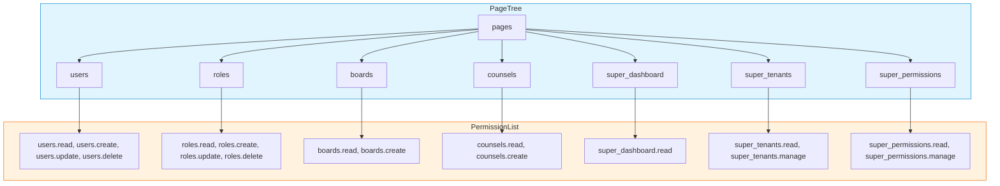

### 11.3 Roles Module

| 항목 | 내용 |
|------|------|
| **경로** | `src/modules/roles/` |
| **책임** | 역할 CRUD, 역할-권한 매핑, 역할-사용자 할당 |
| **엔티티** | Role, UserRole, RolePermission |
| **테넌트 격리** | Role은 tenantId 스코핑, UserRole은 복합 PK에 tenantId 포함 |
| **특이사항** | 역할 상세 조회 시 페이지별 권한 그룹화 + 할당된 사용자 목록 반환 |

### 11.4 Users Module

| 항목 | 내용 |
|------|------|
| **경로** | `src/modules/users/` |
| **책임** | 팀 멤버 CRUD, 상태 변경, 비밀번호 관리, 역할 할당 |
| **엔티티** | User |
| **테넌트 격리** | 모든 쿼리에 tenantId 필터 |
| **특이사항** | 사용자 상세 조회 시 테넌트 전체 역할 목록과 할당 여부 함께 반환 |

### 11.5 Tenants Module

| 항목 | 내용 |
|------|------|
| **경로** | `src/modules/tenants/` |
| **책임** | 테넌트 생명주기 관리, 테넌트별 커스텀 상태 정의 |
| **엔티티** | Tenant, TenantStatus |
| **서비스** | TenantsService, TenantStatusService |
| **특이사항** | TenantStatus: statusGroup + statusKey 조합으로 다목적 상태 정의 (상담 상태 등) |

TenantStatus 구조:
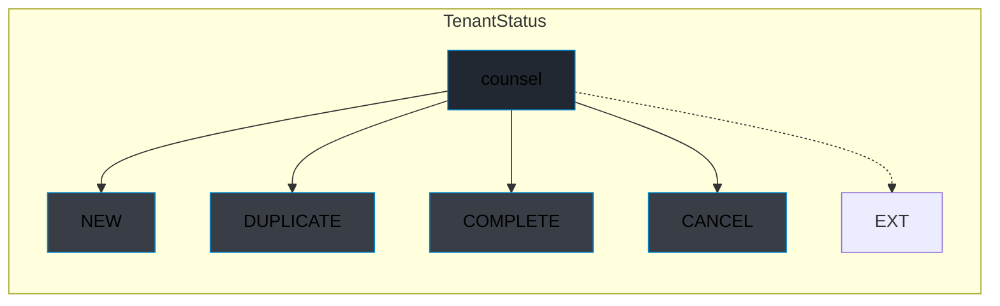

### 11.6 Counsel Module

| 항목 | 내용 |
|------|------|
| **경로** | `src/modules/counsel/` |
| **책임** | 상담 접수(공개 API), 상담 관리, 상태 변경, 메모, 동적 필드 |
| **엔티티** | Counsel, CounselFieldDef, CounselFieldValue, CounselLog, CounselMemoLog |
| **서비스** | CounselService, CounselStatusService, CounselMemoService, CounselFieldService |

동적 필드 시스템 (EAV 패턴):
```mermaid
flowchart LR
    subgraph Def["📝 counsel_field_def"]
        direction TB
        D1["field_id (PK)"]
        D2["tenant_id"]
        D3["field_key · label"]
        D4["field_type · is_required"]
        D5["options_json · placeholder"]
        D6["help_text · default_value"]
        D7["← 테넌트별 독립 정의<br/>스키마 변경 없이 확장 가능"]
    end

    subgraph Val["📊 counsel_field_value"]
        direction TB
        V1["field_id (CPK)"]
        V2["counsel_seq (CPK)"]
        V3["tenant_id (CPK)"]
        V4["value_text"]
        V5["value_number"]
        V6["value_date"]
        V7["value_datetime"]
    end

    Def -->|"1:N"| Val

    style Def fill:#e1f5fe,stroke:#0288d1
    style Val fill:#fff3e0,stroke:#ef6c00
```

상담 생성 플로우 (공개 API — 인증 불필요):
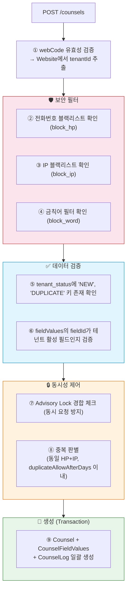

### 11.7 Security Module

| 항목 | 내용 |
|------|------|
| **경로** | `src/modules/security/` |
| **책임** | IP·전화번호·금칙어 블랙리스트 관리 |
| **엔티티** | BlockIp, BlockHp, BlockWord |
| **컨트롤러** | BlockIpController, BlockHpController, BlockWordController |
| **서비스** | BlockIpService, BlockHpService, BlockWordService |
| **특이사항** | BlockWord는 matchType(EXACT, CONTAINS, REGEX) 지원 |

### 11.8 Boards Module

| 항목 | 내용 |
|------|------|
| **경로** | `src/modules/boards/` |
| **책임** | 게시판 CRUD, 게시글 CRUD |
| **엔티티** | Board, Post |
| **서비스** | BoardsService, PostsService |
| **특이사항** | 공지사항(isNotice), 소프트 삭제(deleteState), 게시 기간(startDtm~endDtm) 지원 |

### 11.9 Websites Module

| 항목 | 내용 |
|------|------|
| **경로** | `src/modules/websites/` |
| **책임** | 상담 인테이크 웹사이트 관리 |
| **엔티티** | Website |
| **특이사항** | webCode(PK)로 상담과 연결, duplicateAllowAfterDays로 중복 상담 판단 기간 설정 |

### 11.10 Super Module

| 항목 | 내용 |
|------|------|
| **경로** | `src/modules/super/` |
| **책임** | 슈퍼 관리자 대시보드 (시스템 통계) |
| **접근** | tenantId=1 전용 |
| **데이터** | 전체 테넌트 수, 활성 테넌트, 전체 사용자, 페이지/액션/권한/역할 수 |

### 11.11 Health Module

| 항목 | 내용 |
|------|------|
| **경로** | `src/modules/health/` |
| **책임** | 시스템 진단 (Uptime, 환경, DB 연결 상태) |
| **인증** | 불필요 |
| **기능** | DB `SELECT 1` 쿼리로 연결 상태 확인, 업타임·환경 정보 반환 |

---

## 12. 예외 처리 아키텍처

### 12.1 예외 계층 구조

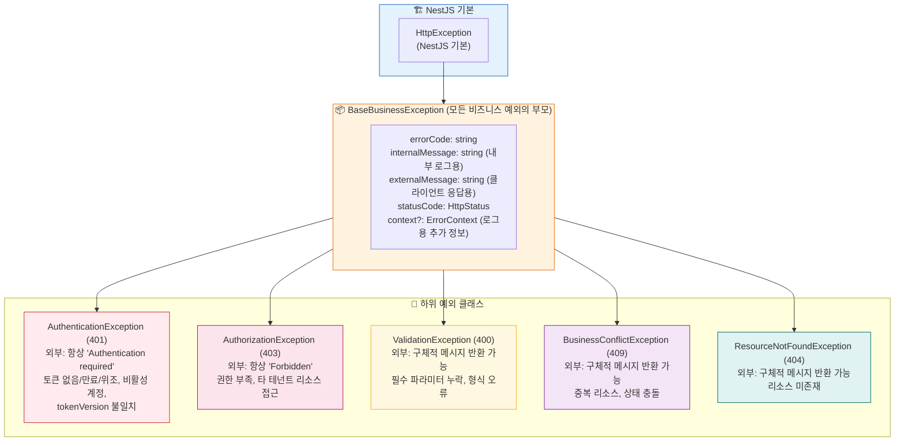

### 12.2 정보 노출 최소화 전략

```mermaid
flowchart LR
    subgraph Internal["📋 내부 로그 (서버)"]
        direction TB
        I1["errorCode: AUTH001"]
        I2["statusCode: 401"]
        I3["internalMessage:<br/>'User not found for JWT<br/>token: userSeq=42'"]
        I4["path: /users"]
        I5["method: GET"]
        I6["ip: 192.168.1.100"]
        I7["userAgent: Mozilla/5.0..."]
        I8["userSeq: null"]
        I9["requestId: a1b2c3d4"]
        I10["→ 로그 시스템으로 전송<br/>(Datadog/ELK 등)"]
    end

    subgraph External["📤 클라이언트 응답 (최소 정보)"]
        direction TB
        E1["error:"]
        E2["  code: 'AUTH001'"]
        E3["  message:<br/>  'Authentication required'"]
        E4["  statusCode: 401"]
        E5["meta:"]
        E6["  requestId: 'a1b2c3d4'"]
        E7["  timestamp: '2026-...'"]
        E8["  path: '/users'"]
        E9["→ 클라이언트에 최소 정보만"]
    end

    Internal ---|"분리"| External

    style Internal fill:#fff3e0,stroke:#ef6c00
    style External fill:#e8f5e9,stroke:#2e7d32
```

---

## 13. 보안 아키텍처

### 13.1 보안 레이어 종합

```mermaid
flowchart TB
    subgraph L1["🛡️ Layer 1: HTTP 보안 헤더 (Helmet)"]
        L1D["X-Content-Type-Options: nosniff<br/>X-Frame-Options: SAMEORIGIN<br/>Strict-Transport-Security<br/>CSP: 비활성 (Swagger UI 호환)"]
    end

    subgraph L2["⏱️ Layer 2: Rate Limiting (Throttler)"]
        L2D["전역: 60 requests / 60 seconds<br/>로그인: 5 requests / 60 seconds<br/>리프레시: 10 requests / 60 seconds"]
    end

    subgraph L3["✅ Layer 3: 입력 검증 (ValidationPipe)"]
        L3D["whitelist: true → DTO에 없는 속성 자동 제거<br/>forbidNonWhitelisted: true → 미지정 속성 시 400 거부<br/>Mass Assignment 공격 원천 차단"]
    end

    subgraph L4["🔐 Layer 4: 인증 (JWT + Passport)"]
        L4D["JWT 서명/만료 검증<br/>tokenVersion 기반 즉시 무효화<br/>Refresh Token Rotation (사용 후 즉시 폐기)"]
    end

    subgraph L5["🛂 Layer 5: 인가 (RBAC)"]
        L5D["page.action 기반 세분화된 권한 검증<br/>PermissionGuard 런타임 강제"]
    end

    subgraph L6["🏢 Layer 6: 멀티테넌시 격리"]
        L6D["tenantId JWT에서 추출 (파라미터 위조 불가)<br/>서비스 레이어 WHERE tenantId = ? 강제<br/>DB Unique Index로 교차 테넌트 충돌 차단"]
    end

    subgraph L7["🚫 Layer 7: 비즈니스 보안 필터 (공개 API)"]
        L7D["IP 블랙리스트 (block_ip)<br/>전화번호 블랙리스트 (block_hp)<br/>금칙어 필터 (block_word: EXACT, CONTAINS, REGEX)<br/>Advisory Lock으로 동시 요청 경합 방지"]
    end

    subgraph L8["🔑 Layer 8: 비밀번호 보안"]
        L8D["bcrypt 해싱 (salt rounds 포함)<br/>응답에서 userPwd, tokenVersion 항상 제외 (toSafeUser)"]
    end

    subgraph L9["🙈 Layer 9: 정보 노출 방지"]
        L9D["인증/인가 오류: 항상 같은 외부 메시지 반환<br/>내부 로그와 외부 응답 분리<br/>Swagger: 운영 환경 비활성화"]
    end

    subgraph L10["📊 Layer 10: 추적 및 모니터링"]
        L10D["Request ID (UUID) - 모든 요청마다 고유 ID<br/>에러 로그에 requestId, IP, userAgent, userSeq 포함<br/>운영: 1초 이상 쿼리 자동 로깅"]
    end

    L1 --> L2 --> L3 --> L4 --> L5
    L5 --> L6 --> L7 --> L8 --> L9 --> L10

    style L1 fill:#e3f2fd,stroke:#1565c0
    style L2 fill:#e1f5fe,stroke:#0288d1
    style L3 fill:#e0f7fa,stroke:#00838f
    style L4 fill:#e8f5e9,stroke:#2e7d32
    style L5 fill:#f1f8e9,stroke:#558b2f
    style L6 fill:#fff8e1,stroke:#f9a825
    style L7 fill:#fff3e0,stroke:#ef6c00
    style L8 fill:#fbe9e7,stroke:#d84315
    style L9 fill:#fce4ec,stroke:#c62828
    style L10 fill:#f3e5f5,stroke:#7b1fa2
```

### 13.2 환경별 보안 설정

| 설정 | 개발 | 운영 |
|------|------|------|
| Swagger | ✅ 활성 | ❌ 비활성 |
| DB synchronize | ❌ `false` | ❌ `false` |
| DB migrationsRun | 설정 가능 | ❌ 수동만 |
| DB logging | 설정 가능 | error, warn만 |
| 슬로우 쿼리 로깅 | - | 1초 이상 |
| trust proxy | 1 | 1 (Railway/Nginx) |
| 환경변수 검증 | 스키마 검증 | 스키마 검증 |

---

## 14. API 엔드포인트 맵

### 시스템

| Method | Path | 인증 | 권한 | 설명 |
|--------|------|------|------|------|
| GET | `/` | ❌ | - | 루트 헬스체크 |
| GET | `/health` | ❌ | - | 상세 시스템 진단 (DB 상태 포함) |

### 인증

| Method | Path | 인증 | 권한 | Rate Limit | 설명 |
|--------|------|------|------|------------|------|
| POST | `/auth/signup` | ❌ | - | - | 기업 가입 |
| POST | `/auth/login` | ❌ | - | 5/60s | 로그인 |
| POST | `/auth/refresh` | ❌ | - | 10/60s | 토큰 갱신 |
| POST | `/auth/logout` | ✅ | - | - | 로그아웃 |
| GET | `/auth/me` | ✅ | - | - | 내 정보 + 권한 |
| PATCH | `/auth/me` | ✅ | - | - | 프로필 수정 |
| POST | `/auth/change-password` | ✅ | - | - | 비밀번호 변경 |

### 사용자 관리

| Method | Path | 권한 | 설명 |
|--------|------|------|------|
| GET | `/users` | users.read | 사용자 목록 |
| GET | `/users/:id` | users.read | 사용자 상세 |
| POST | `/users` | users.create | 팀 멤버 생성 |
| PATCH | `/users/:id` | users.update | 사용자 수정 |
| PATCH | `/users/:id/status` | users.update | 상태 변경 |
| PATCH | `/users/:id/password` | users.update | 비밀번호 변경 |
| PUT | `/users/:id/roles` | users.update | 역할 할당 |

### 역할 관리

| Method | Path | 권한 | 설명 |
|--------|------|------|------|
| GET | `/roles` | roles.read | 역할 목록 |
| GET | `/roles/:id` | roles.read | 역할 상세 (권한 + 사용자 포함) |
| POST | `/roles` | roles.create | 역할 생성 |
| PATCH | `/roles/:id` | roles.update | 역할 수정 |
| DELETE | `/roles/:id` | roles.delete | 역할 삭제 |
| PUT | `/roles/:id/permissions` | roles.update | 권한 할당 |
| PUT | `/roles/:id/users` | roles.update | 사용자 할당 |

### 권한 카탈로그

| Method | Path | 권한 | 설명 |
|--------|------|------|------|
| GET | `/permissions/catalog` | (인증만) | 권한 카탈로그 (페이지/액션/매트릭스) |

### 상담 관리

| Method | Path | 권한 | 설명 |
|--------|------|------|------|
| POST | `/counsels` | ❌ (공개) | 상담 생성 |
| GET | `/counsels` | counsels.read | 상담 목록 |
| GET | `/counsels/:id` | counsels.read | 상담 상세 |
| PATCH | `/counsels/:id` | counsels.update | 상담 수정 |
| DELETE | `/counsels/:id` | counsels.delete | 상담 삭제 |
| PATCH | `/counsels/:id/status` | counsels.update | 상태 변경 |
| GET | `/counsels/:id/logs` | counsels.read | 상태 변경 이력 |
| POST | `/counsels/:id/memos` | counsels.update | 메모 작성 |
| GET | `/counsels/:id/memos` | counsels.read | 메모 목록 |
| DELETE | `/counsels/:id/memos/:memoId` | counsels.update | 메모 삭제 |

### 보안

| Method | Path | 권한 | 설명 |
|--------|------|------|------|
| GET/POST/PATCH/DELETE | `/security/block-ip/*` | security/block-ip.* | IP 차단 관리 |
| GET/POST/PATCH/DELETE | `/security/block-hp/*` | security/block-hp.* | 전화번호 차단 관리 |
| GET/POST/PATCH/DELETE | `/security/block-word/*` | security/block-word.* | 금칙어 관리 |

### 게시판

| Method | Path | 권한 | 설명 |
|--------|------|------|------|
| GET/POST/PATCH/DELETE | `/boards/*` | boards.* | 게시판 CRUD |
| GET/POST/PATCH/DELETE | `/boards/:id/posts/*` | boards.* | 게시글 CRUD |

### 웹사이트

| Method | Path | 권한 | 설명 |
|--------|------|------|------|
| GET/POST/PATCH/DELETE | `/websites/*` | websites.* | 웹사이트 관리 |

### 슈퍼 관리자

| Method | Path | 권한 | 설명 |
|--------|------|------|------|
| GET | `/super` | super/dashboard.read | 대시보드 통계 |
| GET/POST/PATCH | `/tenants/*` | super/tenants.* | 테넌트 관리 |
| GET/POST/PATCH/DELETE | `/permissions-admin/*` | super/permissions.* | 페이지/액션/권한 CRUD |

---

> **문서 생성일:** 2026-03-13  
> **대상 버전:** FlowDesk Admin Backend v0.0.1  
> **기술 기반:** NestJS 11 + TypeORM 0.3 + MySQL 8
